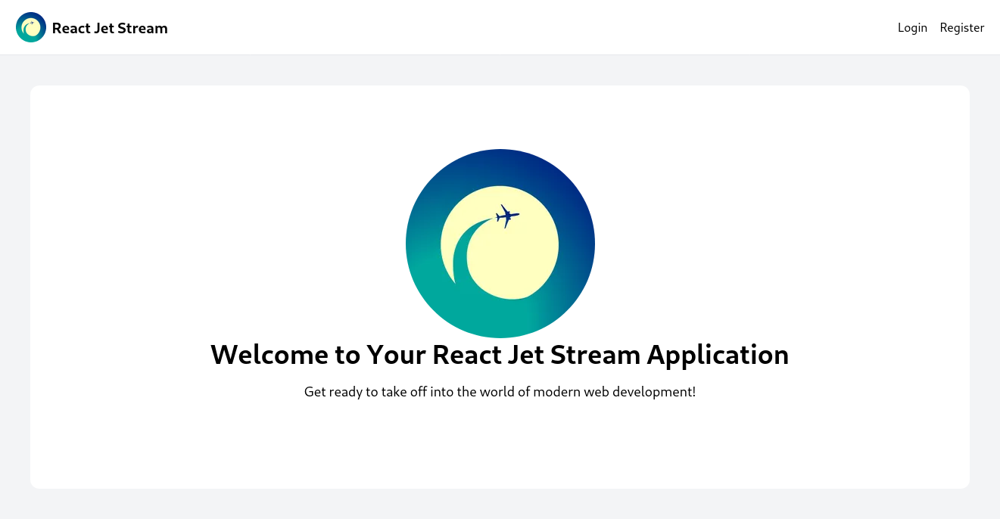
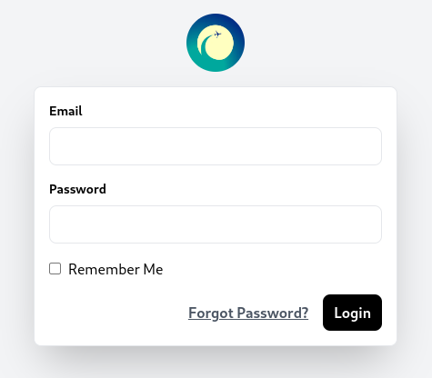
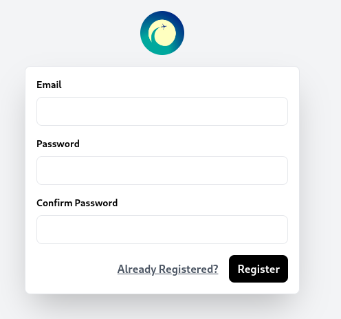
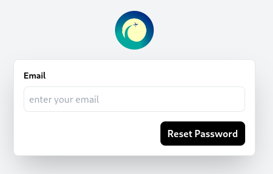
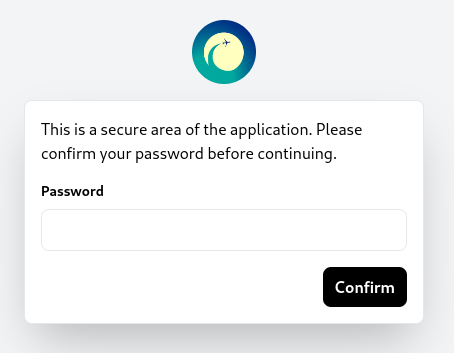

# <p align="center">React JetStream</p>
  
React JetStream is a sleek and simplistic React template, elegantly designed with Tailwind CSS, inspired by Laravel Jetstream. Perfect for effortless development of modern web applications with a clean and minimalist aesthetic.
    
## 🧐 Features
### UI
- Login
- Registration
- Forgot Password
- Confirm Password
        
## 🛠️ Tech Stack
- [React](https://reactjs.org/)
- [React Icons](https://react-icons.github.io/react-icons/)
- [React Router](https://reactrouter.com/en/main)
- [Vite](https://vitejs.dev/)
- [Tailwind CSS](https://tailwindcss.com/)
    
## 🛠️ Installation    
 ```bash
npx @calvin-kimani/create-jetstream-app@latest test
```

## Screenshots






## 🍰 Contributing    
Contributions are what make the open source community such an amazing place to be learn, inspire, and create. Any contributions you make are **greatly appreciated**.

Before contributing, please read the [code of conduct](CODE_OF_CONDUCT.md) & [contributing guidelines](CONTRIBUTING.md).
 

## ❤️ Support  
A simple star to this project repo is enough to keep me motivated on this project for days. If you find your self very much excited with this project let me know with a tweet.

If you have any questions, feel free to reach out to me on [Twitter](https://twitter.com/0x776F6C66).


## 🙇 Author
#### Calvin Kimani
- Twitter: [@0x776F6C66](https://twitter.com/0x776F6C66)
- Github: [@calvin-kimani](https://github.com/calvin-kimani)
        
        
 
## ➤ License
Distributed under the ISC License. See [LICENSE](LICENSE) for more information.
        
        
